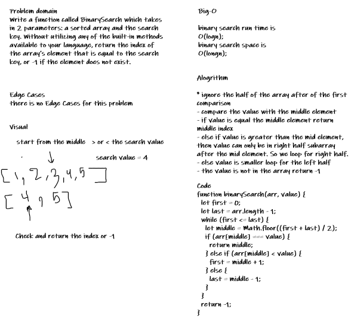

# Array binary search

Search for an element in array using the binary search algo.

## Challenge

Write a function called BinarySearch which takes in 2 parameters: a sorted array and the search key. Without utilizing any of the built-in methods available to your language, return the index of the array’s element that is equal to the search key, or -1 if the element does not exist.

## Approach & Efficiency

The binary search reduce the time of search from `O(n)` to `O(log(n))` this is greate but it's only work if the array is already sorted so if we face an array not sorted we need to sort it first then use the binary search which not very helpfull in some casses.

## Solution

;
