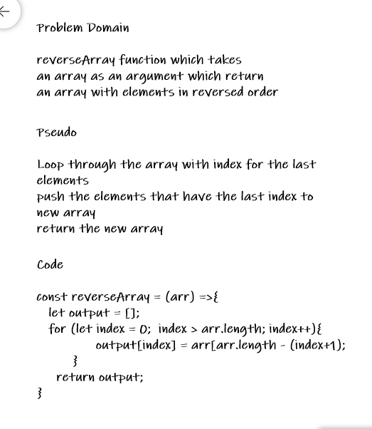

# Reverse an Array

Simply you need to reverse an array which mean the first element should be the last element and so on.

## Challenge

Write a function called reverseArray which takes an array as an argument. Without utilizing any of the built-in methods available to your language, return an array with elements in reversed order.!-- Description of the challenge -->

## Approach & Efficiency

<!-- What approach did you take? Why? What is the Big O space/time for this approach? -->

Nothing new It's just a very simple question with two step only :)

## Solution

<!-- Embedded whiteboard image -->

;
