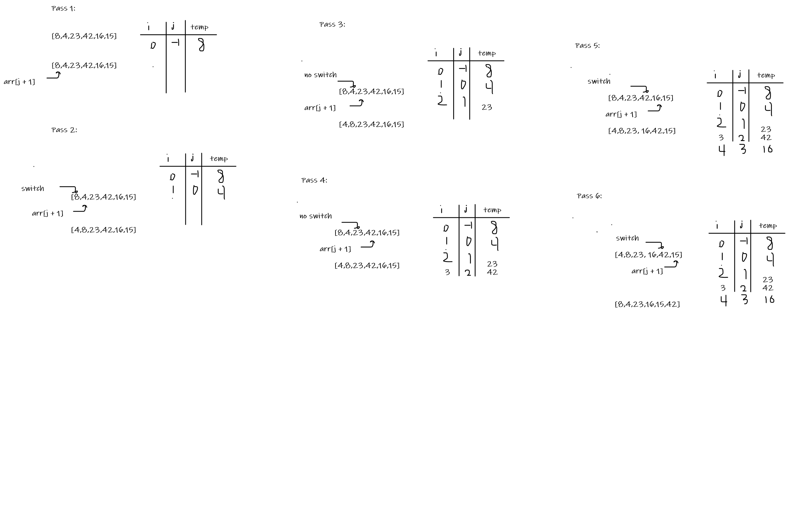

# Insertion Sort

Insertion sort is a simple sorting algorithm that works similar to the way you sort playing cards in your hands. The array is virtually split into a sorted and an unsorted part. Values from the unsorted part are picked and placed at the correct position in the sorted part.

## Pseudocode

```pseudocode
  InsertionSort(int[] arr)

    FOR i = 1 to arr.length

      int j <-- i - 1
      int temp <-- arr[i]

      WHILE j >= 0 AND temp < arr[j]
        arr[j + 1] <-- arr[j]
        j <-- j - 1

      arr[j + 1] <-- temp
```

## Trace

sample Array: [8,4,23,42,16,15]

### Whiteboard



#### Pass 1: -see the white board

we have nested loops, i to loop through the hole array, j the value we gonna use to check.
first iteration i = 0, j = -1, temp = 8, so the array stay as it's without change.

#### Pass 2:

Second iteration i = 1, j = 0, temp = 4, since the previeous value is 8 switch between 8 and 4
[4, 8, 23, 42, 16, 15]

#### Pass 3:

Third Iteration i = 2, j = 1, temp 23, 23 is greater than the previous value - 4 - the array stay as it is.

#### Pass 4:

Fourth iteration i = 3, j = 2, temp 42, 42 is greater than the previous value - 23 - the array stay as it is.

#### Pass 5:

Fifthe Iteration i = 4, j = 3, temp 16, 16 is less than teh previous value - 42 - switch between them.

[4, 8, 23, 16, 42, 15]

#### Pass 6:

Sixth iteration i = 5, j = 4, temp 15, 15 is less than the previous value - 42 - switch between them.

[4, 8, 23, 16, 15, 42]

Note: it will keep looping in the same sequence until it all sorted

[4, 8, 16, 15, 23, 42]

#### Efficency

Time: O(n^2)
Since we are using nested loop the time complexity will increas as you see.
Space: O(1)
We are using the same array and return it so the space complexity will stary O(1).
