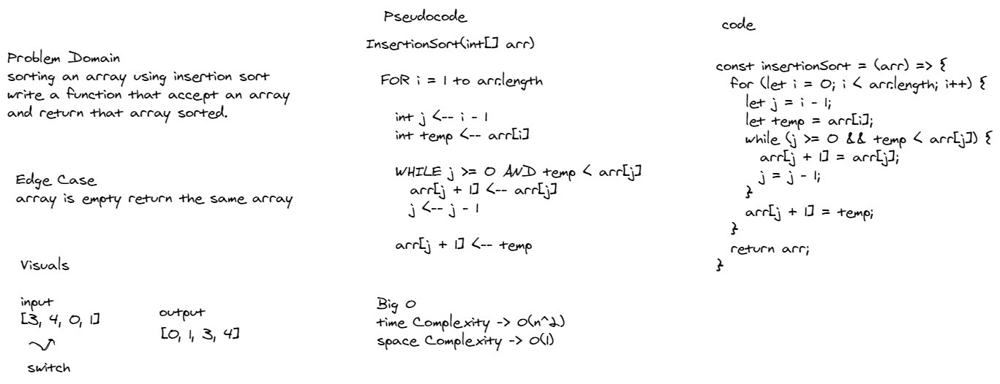

# Challenge Summary

Insertion sort is a simple sorting algorithm that works similar to the way you sort playing cards in your hands. The array is virtually split into a sorted and an unsorted part. Values from the unsorted part are picked and placed at the correct position in the sorted part.

## Challenge Description

Write a blog that explain and trace the code of insertion sort

## Approach & Efficiency

Insertion Sort Time complexity -> O(n^2) and space complexity -> O(1)

## Solution

