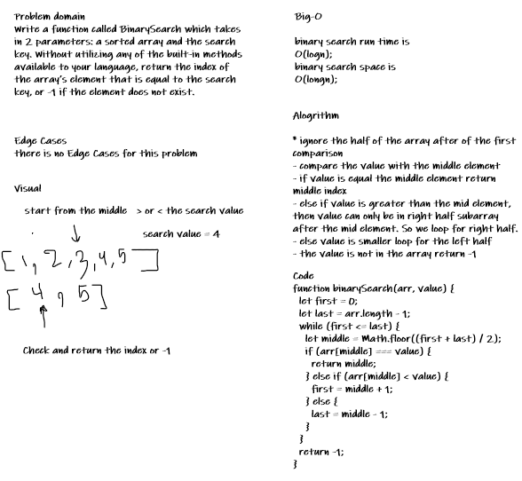

# Challenge Summary

Create an function that accept two value and return alterante list of them.

## Challenge Description

Write a function called zipLists which takes two linked lists as arguments. Zip the two linked lists together into one so that the nodes alternate between the two lists and return a reference to the head of the zipped list. Try and keep additional space down to O(1). You have access to the Node class and all the properties on the Linked List class as well as the methods created in previous challenges.

## Approach & Efficiency

The time complexity of zipList is Big O O(n^2) which is bad but I think there is no other way.
The space compexlity is O(n) which the best I can do.

## Solution

<!-- Embedded whiteboard image -->

;
