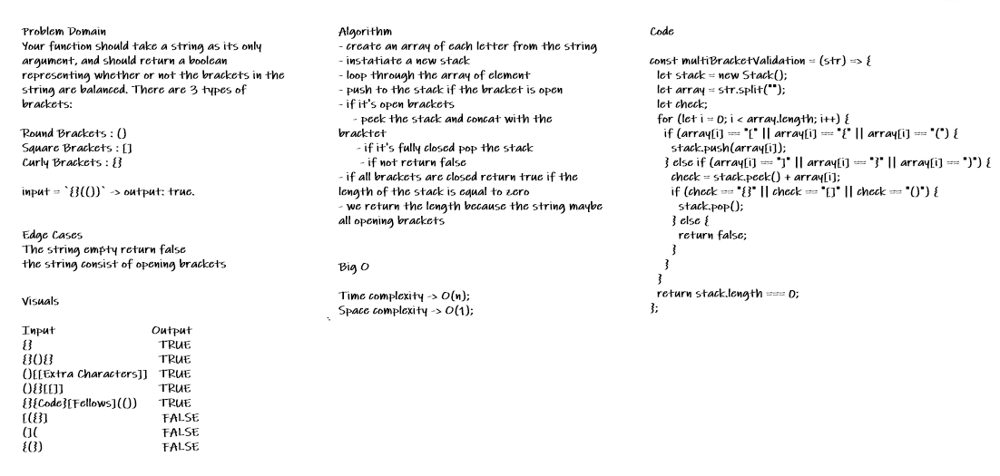

# Challenge Summary

<!-- Short summary or background information -->

Here in this challenge where the Stack become applicable because of the LIFO.
We use that to check the opening bracket with the stack peek to check if it close or not.

## Challenge Description

<!-- Description of the challenge -->

Your function should take a string as its only argument, and should return a boolean representing whether or not the brackets in the string are balanced. There are 3 types of brackets:

Round Brackets : ()
Square Brackets : []
Curly Brackets : {}

## Approach & Efficiency

- multiBracketValidation: take a string as an arguement and check of all the bracket are all closed. Big O time complexity is O(n), Space complexity O(1).

## Solution

<!-- Embedded whiteboard image -->

;
