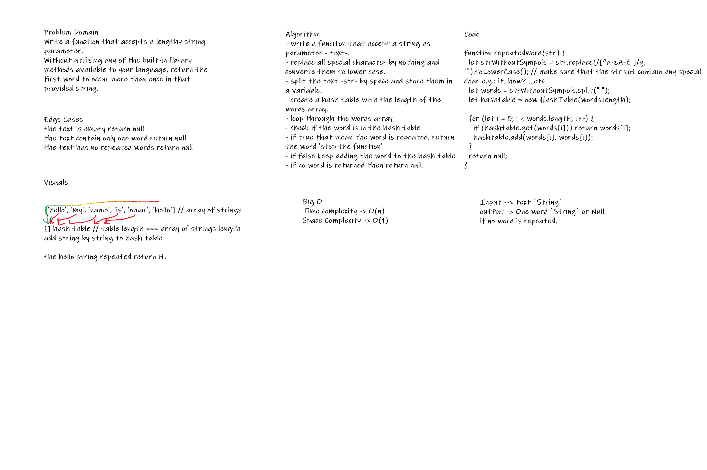

# Challenge Summary

utilizing the hashtable data structure I want to solve the repeated word problem that will return the first word repeated in the text.

## Challenge Description

Write a function that accepts a lengthy string parameter.
Without utilizing any of the built-in library methods available to your language, return the first word to occur more than once in that provided string.

## Approach & Efficiency

- repeatedWord: Time Complexity -> O(n) Space Complexity -> O(1).

## Solution

