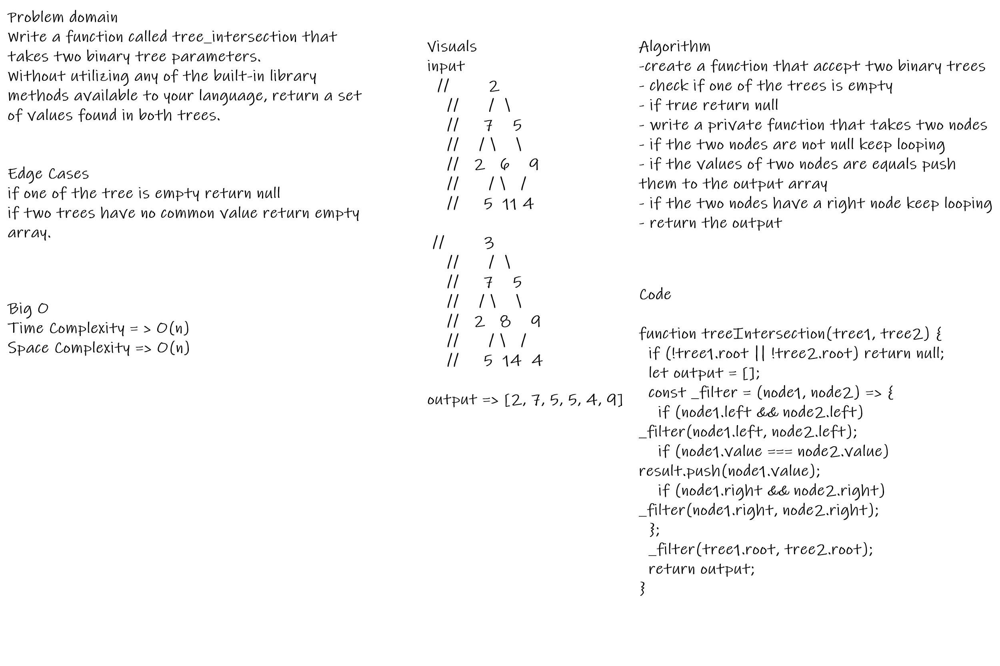

# Challenge Summary

You need to find most common values between two binary trees.

## Challenge Description

Write a function called tree_intersection that takes two binary tree parameters.
Without utilizing any of the built-in library methods available to your language, return a set of values found in both trees.

## Approach & Efficiency

Using recursion to solve the problem: Time Complexity => O(n), Space Complexity O(n)

## Solution

