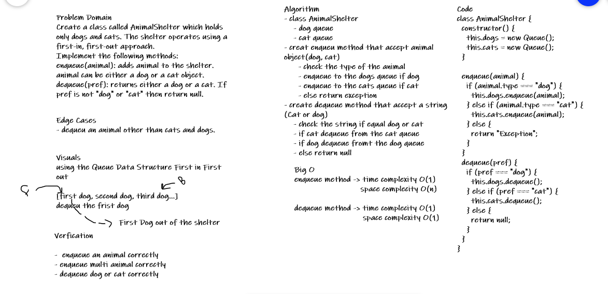

# Challenge Summary

Simple Question, with no clear requiremnts actually, I have used my Queue to enqueue and dequeue from the shelter.

## Challenge Description

Create a class called AnimalShelter which holds only dogs and cats. The shelter operates using a first-in, first-out approach.
Implement the following methods:
enqueue(animal): adds animal to the shelter. animal can be either a dog or a cat object.
dequeue(pref): returns either a dog or a cat. If pref is not "dog" or "cat" then return null.

## Approach & Efficiency

Using the Queue Data Structure keep time and space complexity O(1)

- enqueue method: Which take an animal object - dog or cat- and add it to the shelter.
- dequeue method: Accept an animal - dog or cat- string and dequeue it from the shelter.

## Solution

