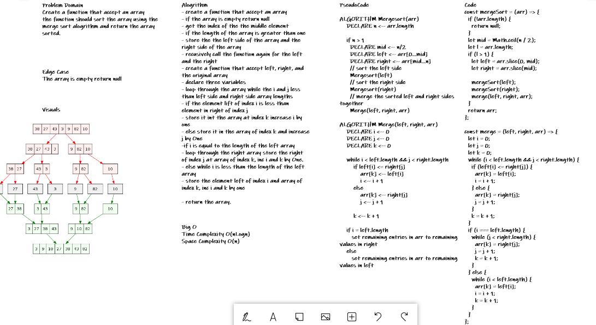

# Challenge Summary

Merge sort is one of the most efficient sorting algorithms. It works on the principle of Divide and Conquer. Merge sort repeatedly breaks down a list into several sublists until each sublist consists of a single element and merging those sublists in a manner that results into a sorted list.

## Challenge Description

Create a function that accept an array
the function should sort the array using the
merge sort alogrithm and return the array sorted.

## Approach & Efficiency

Time Complexity -> O(nlogn)
Space Compexity -> O(n)

## Solution

