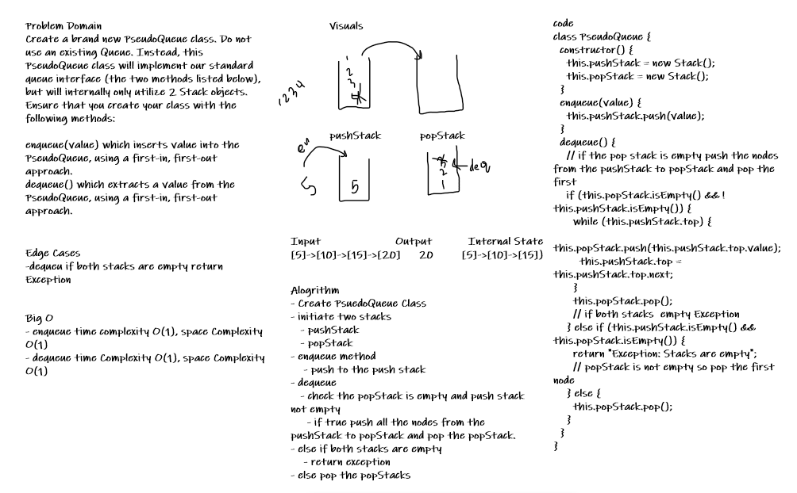

# Challenge Summary

Create queue with two stacks will reduce the time complexity of dequeue to O(1). In the first time the dequeue will loop for one time to add the value to popStack. Then the dequeue will become O(1) for enqueue and dequeue.

## Challenge Description

Create a brand new PseudoQueue class. Do not use an existing Queue. Instead, this PseudoQueue class will implement our standard queue interface (the two methods listed below), but will internally only utilize 2 Stack objects. Ensure that you create your class with the following methods:

enqueue(value) which inserts value into the PseudoQueue, using a first-in, first-out approach.
dequeue() which extracts a value from the PseudoQueue, using a first-in, first-out approach.

## Approach & Efficiency

- enqueue: time Complexity O(1) and space complexity O(n).

- dequeue: time Complexity for the dequeue depends if the pushStack is not empty the time complexity will be O(n), after that will become O(1).

## Solution

;
