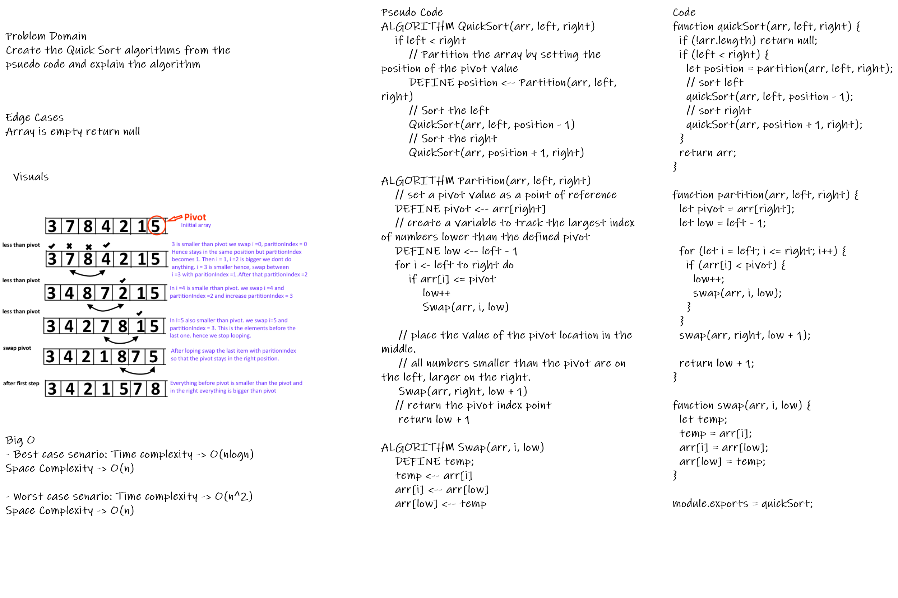

# Challenge Summary

Quicksort is a divide-and-conquer algorithm. It works by selecting a 'pivot' element from the array and partitioning the other elements into two sub-arrays, according to whether they are less than or greater than the pivot.

## Challenge Description

Create the Quick Sort algorithms from the psuedo code and explain the algorithm

## Approach & Efficiency

- Best case senario: Time complexity -> O(nlogn) Space Complexity -> O(n)

- Worst case senario: Time complexity -> O(n^2) Space Complexity -> O(n)

## Solution

