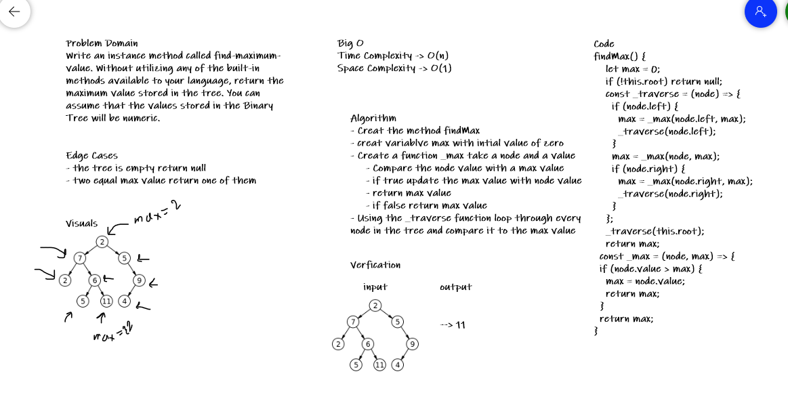
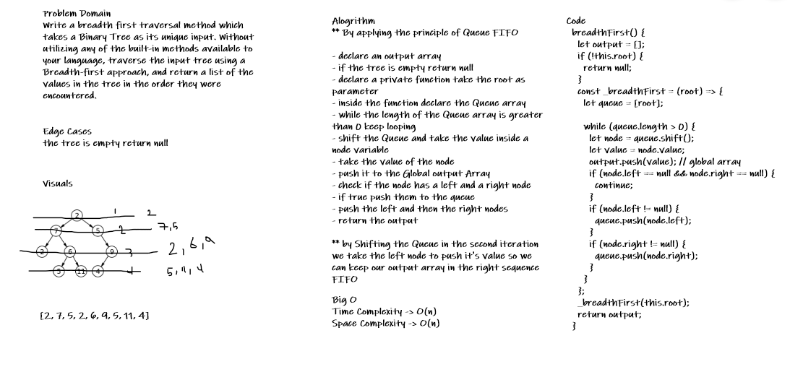

# Trees

In computer science, a binary tree is a tree data structure in which each node has at most two children, which are referred to as the left child and the right child.

## Challenge

Problem domain
Create a Node class that has properties for the value stored in the node, the left child node, and the right child node.
Create a BinaryTree class
Define a method for each of the depth first traversals called preOrder, inOrder, and postOrder which returns an array of the values, ordered appropriately.

Create a BinarySearchTree class
Define a method named add that accepts a value, and adds a new node with that value in the correct location in the binary search tree.
Define a method named contains that accepts a value, and returns a boolean indicating whether or not the value is in the tree at least once.>

## Approach & Efficiency

Useing Recursion make you think in another way for binary search tree.

- add methode : Big O -> time O(nlogn) space O(n);
- contains method: Big O -> time O(nlogn) space O(1);

## API

- Binary Tree:

  - preOrder: Root - Left - Right. Big O Time -> O(n)
  - inOrder : left - Root - Right. Big O Time -> O(n)
  - postOrder: Root - Left - Right. Big O Time -> O(n)
  - findMax: return the maximum value in the tree -> time complexity = O(n) Space complexity = O(1)
  - breadthFirst: return an array of each node value by level -> time complexity = O(n) Space Complexity = O(n)

- Binary Search Tree:
  - add method: add a value to the tree
  - contains method: return true if the tree contain the value.

### Find Max Whiteboard

